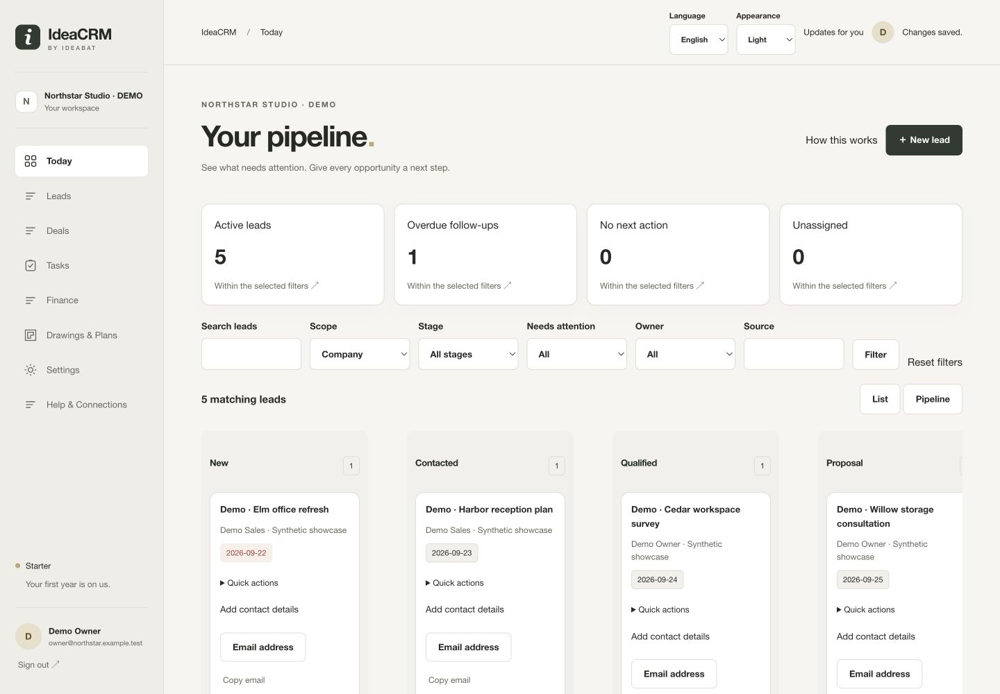
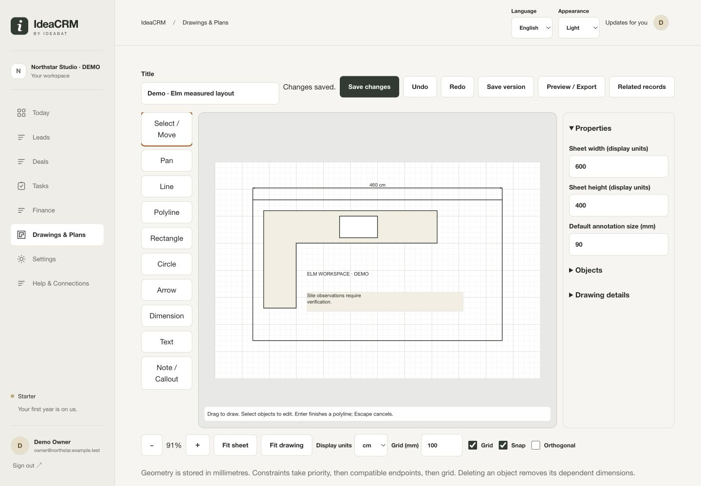
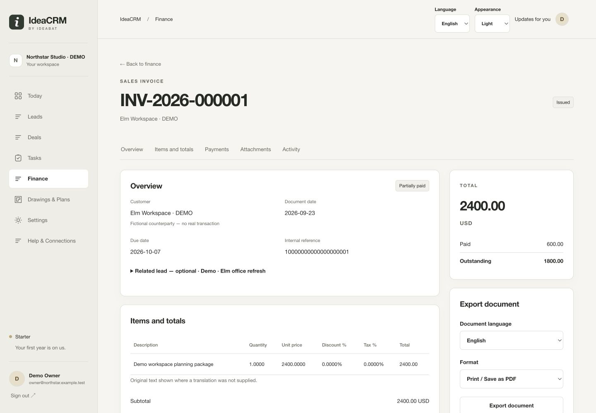
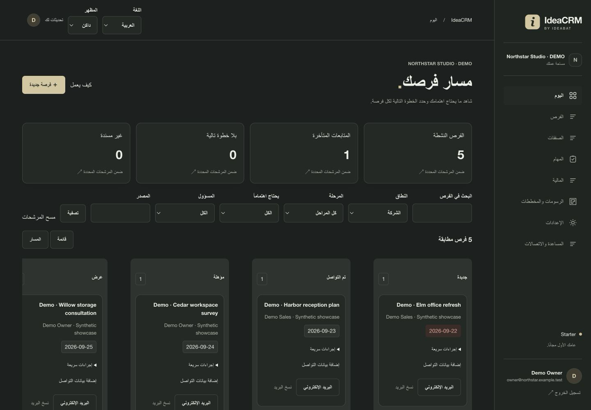

# IdeaCRM

**A shared workspace for leads, follow-ups, proposals, commercial documents and measured plans.**

IdeaCRM keeps the work around a business relationship connected: who owns the opportunity, what happens next, what has been proposed and which records support the work. Developed by **Ragıp Mullamusa / Ideabat**, it combines a multilingual company portal with a focused public entry and separate platform administration.



*Real local application screen with synthetic demonstration data. Dashboard counts are not customer outcome metrics.*

## From enquiry to working context

- **Leads and follow-ups:** ownership, pipeline/list views, attention filters, saved notes, activity and scheduled next actions.
- **Deals:** scope, commercial stages, optional lead association, tasks and preserved proposal versions. A won deal is a staff-reported outcome, not proof of payment or a signed contract.
- **Finance:** independent sales invoices and supplier-bill-style purchases, optional lead links, decimal-safe totals, finalized snapshots, partial-payment records and private evidence. Issued/Posted/Void is separate from Unpaid/Partially paid/Paid.
- **Drawings & Plans:** editable 2D lines, shapes, notes and dimensions using native SVG and validated JSON geometry. Canonical millimetres, display units and saved revision checkpoints remain distinct from the viewport.
- **Shared context:** typed related-record links recheck access to both records. A relationship does not grant financial access or duplicate a document.
- **Language and appearance:** English, Arabic RTL and Turkish; shared Light/Dark/System preferences. Financial export language is independent of interface language. User-entered text is not automatically translated.



*The measured-sketch editor after a unit change, save and reopen. This is a practical 2D tool, not CAD/BIM or certified engineering output.*



*Synthetic invoice: an issued document, a recorded partial settlement and an outstanding balance. No real money moved.*

## One application, distinct surfaces

| Surface | Audience and scope | Verification |
|---|---|---|
| Public web | Introduction, registration and sign-in | Landing and normal sign-in opened locally |
| Company portal | Owners/managers, sales, accounting and viewers through permissions | Owner, sales and accountant views opened; representative desktop/mobile viewport, EN/AR/TR and themes |
| Platform administration | Separately provisioned platform operators | Overview, demo free-period extension and protected Meta settings opened |
| Backend APIs and workers | Shared services, protected routes, queued integrations | Source-inspected and focused native tests; external provider delivery unverified |
| Flutter | Reserved documentation only | No runnable native application |

These roles are not separate app binaries. A company owner is not a platform administrator. No public production release is asserted by this local showcase.



*Arabic RTL and dark mode are actual application preferences, not altered screenshots.*

## Architecture and technology

PHP 8.2+ implements business rules, authorization and rendering. PDO uses prepared queries against a MySQL/InnoDB-oriented schema. The current local database run used MariaDB 10.4.28. Custom HTML/CSS and vanilla JavaScript provide the portal; native SVG renders editable drawing geometry. BCMath handles authoritative monetary arithmetic. ZipArchive/XMLWriter/XMLReader support real XLSX documents. No Composer, npm build, framework, vendor UI kit or CDN is required.

Public entry points delegate to an explicit named-route registry and controllers. Services enforce domain rules for both portal and API actions; `Repository.php` and `Queries.php` own SQL. Revalidated membership supplies tenant context. Private upload bytes stay under company directories and pass parent-record authorization on download.

```text
app/
  core/          Routes, controllers, repository and query catalog
  modules/       Auth, CRM, deals, finance, drawings, relations, integrations
  views/         Public, portal, administration and document layouts
  console/       Installation, migration, diagnostics and workers
  tests/         Native unit, HTTP, database and concurrency checks
assets/          Custom CSS/JavaScript and protected company uploads
database/        Sealed baseline, seeds and ordered additive updates
portal/ admin/   Thin public entry points
flutter_app/     Reserved client documentation
docs/            Product, architecture, contracts and implementation status
```

Finalized financial snapshots preserve historical document fields. Deal preparation creates a saved proposal version. Drawings retain editable drafts and immutable checkpoints. Those histories are not interchangeable with live associations or changing contact data.

## Integration and export boundaries

Meta Lead Ads has protected platform configuration, a company setup wizard and server-side OAuth/webhook/queue/import code. WhatsApp-related code and contact actions are separate. Current local configuration has no verified live provider delivery, public HTTPS callback or provider approval. A saved setting is not evidence of a successful import or message.

Financial documents provide **Print / Save as PDF** through authenticated browser views, plus native XLSX/CSV output. There is no direct server-generated PDF claim. Code 128 document references identify records; they do not grant access or imply tax certification.

The drawing editor and saved preview ran locally. **Its Download PNG action reported a generation error in the tested browser**, and remains a follow-up. Browser previews do not prove saved-PDF quality, paper scanning or physical scale. Payment processing, email delivery and a native mobile app are not implemented. See [current product status](#) and the [current showcase evidence](#) for the distinction between implemented and verified behavior.

## Safe local setup

Required: PHP 8.2+, PDO MySQL, mbstring, fileinfo, OpenSSL and BCMath; ZipArchive/XMLWriter/XMLReader for XLSX. Optional provider transport requires cURL. Apache needs PHP, mod_rewrite and `AllowOverride All`. Optional intl was absent in the tested runtime. MySQL 8 compatibility and production deployment are not certified by the MariaDB local run.

1. Create an **empty dedicated local database** using utf8mb4/utf8mb4_unicode_ci and a dedicated database user. Keep runtime privileges narrower than migration privileges.
2. Copy `.env.example` to `.env` and configure credentials privately, the exact `BASE_URL` including any subdirectory, and `APP_ENV=development` for local tests. Never commit `.env`.
3. From the repository root, install and check:

```sh
php app/console/install.php --fresh
php app/console/diagnose.php
```

The installer refuses a nonempty database. The sealed baseline is `ideacrm-2026-09-22-stable-2`, absorbing updates 001–014. Fresh installation applies the baseline plus current additive updates 015–021. Existing installations must follow [database policy](#), take backups and verify preconditions before `php app/console/migrate.php --apply`. Never replay seeds or retired migrations on existing data. DDL does not roll back like ordinary data transactions.

4. Serve with Apache and verify `.htaccess` protections for app, database, docs, dotfiles and private uploads. Only runtime and company-upload directories need web-process write access. PHP's built-in server does not enforce these protections.
5. Use HTTPS for deployment and keep trusted `BASE_URL` consistent with the proxy/host configuration. This is a deployment requirement, not proof of production readiness.

Optional macOS/XAMPP local helper:

```sh
php app/console/serve-apache.php 8086 start
# When this specific local helper is no longer needed:
php app/console/serve-apache.php 8086 stop
```

The helper binds to loopback and requires POSIX and an Apache installation containing `modules/libphp.so`. With its subdirectory alias, use `http://localhost:8086/ideacrm` as the local base. The public landing is `/`; company sign-in is `/login`; the portal is `/portal/`. These are local routes, not a published demo.

Platform operators use the existing CLI provisioning path:

```sh
php app/console/admin-create.php operator@example.test 'Platform Operator'
```

Supply a 12–72-byte password on standard input, never as a command argument. The command refuses to elevate an existing company identity. Sign in normally; a platform identity without company membership enters `/admin/`.

## Verification

Executed during the 2026-09-23 local showcase:

```sh
php app/tests/unit.php           # 14 passed
php app/tests/finance-unit.php   # 47 passed
php app/tests/quick-contact.php  # 39 passed
```

Fresh install and diagnostics passed. Browser checks covered normal role logins, lead-note persistence, drawing unit/save/reopen, Arabic financial preview, theme/language controls, a denied sales purchase route, wizard progress and a synthetic platform extension. The gallery contains 17 inspected current captures across all three visual surfaces.

Broader native integration, HTTP, security and concurrency suites are under `app/tests/`; follow the [test plan](#). Fixture-creating tests may run only in an explicitly local development database. They create data/cookies and can encounter the real login throttle; never disable protections to make tests pass. Historical results are not presented as rerun here. Firefox, Safari/iPad, saved PDF/paper and live provider checks remain unverified in this review.

## Project materials and attribution

Browse the [publishing kit](#), [screenshot map](screenshoots/SCREENSHOT_MAP.md) and [project documentation index](#).

Built by [Ragıp Mullamusa](https://ceo.ideabat.com), Founder & Software Engineer at [Ideabat](https://ideabat.com) — Product Engineering & Operational Software. [Personal LinkedIn](https://www.linkedin.com/in/ragipmullamusa/).

No license file was found in this checkout. No license is granted or changed by this README; do not infer open-source status. No confirmed public IdeaCRM demo or repository URL is supplied.
